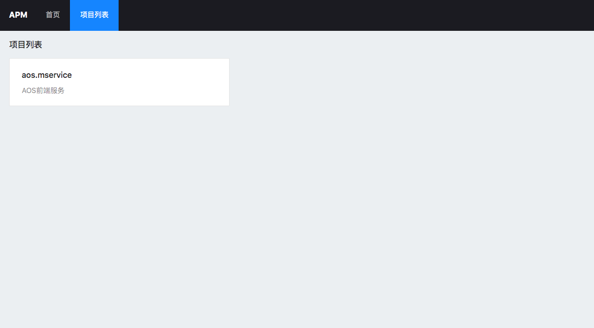
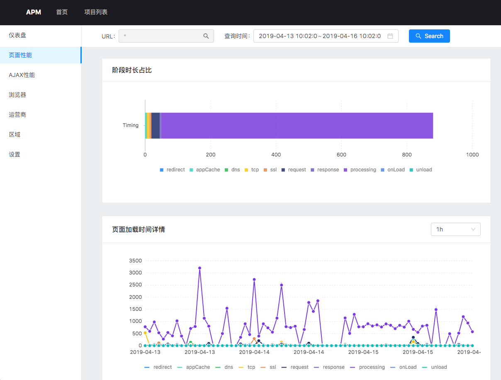
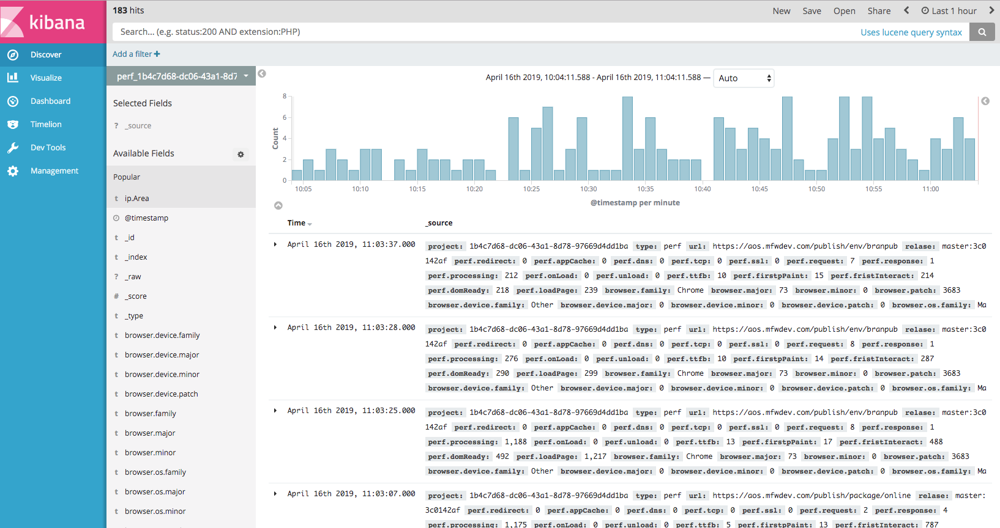
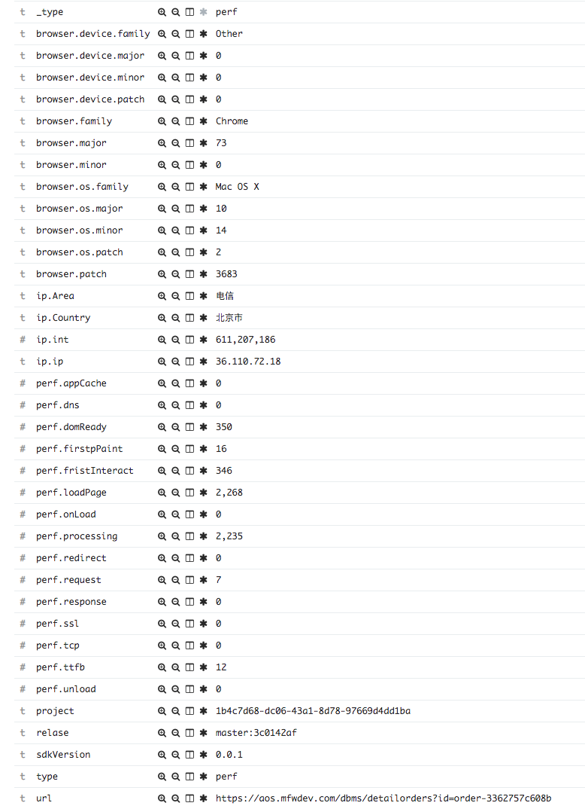

# Application Performance Monitor

环境:
- NodeJS 10+
- ElasticSearch 5.6.3
- Kibana 5.6.3 **可选**

## DEMO

## 模块划分
该项目分为4块子项目

- worker     - 负责采集 nginx 日志
- service    - 负责接收 worker 消息和对外 GRPC 接口
- api        - 对外接口
- web        - 前端项目
